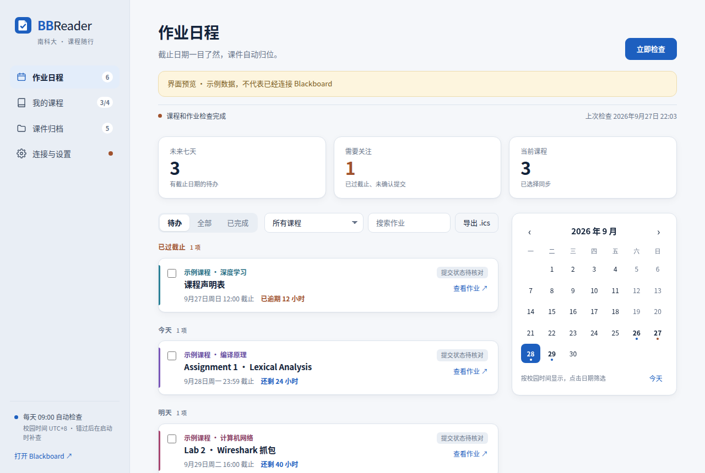
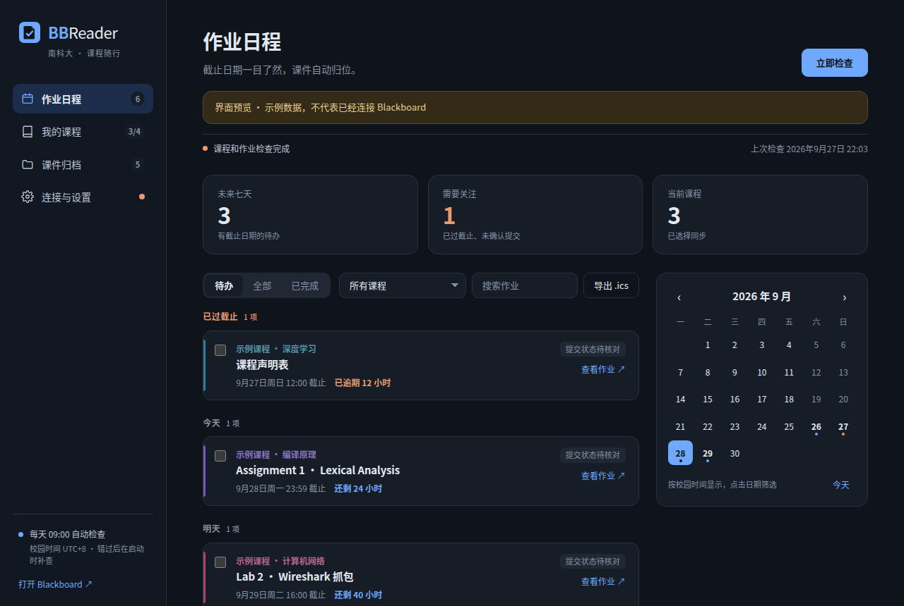
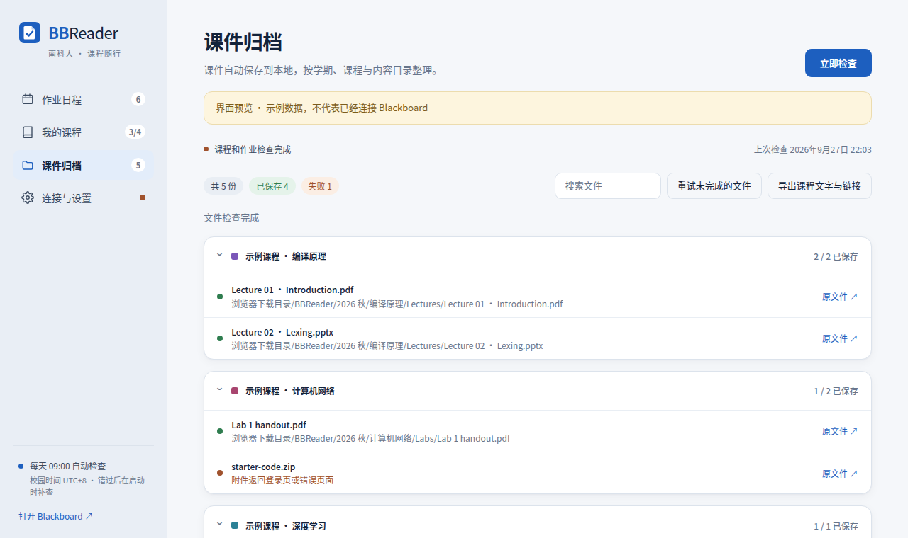
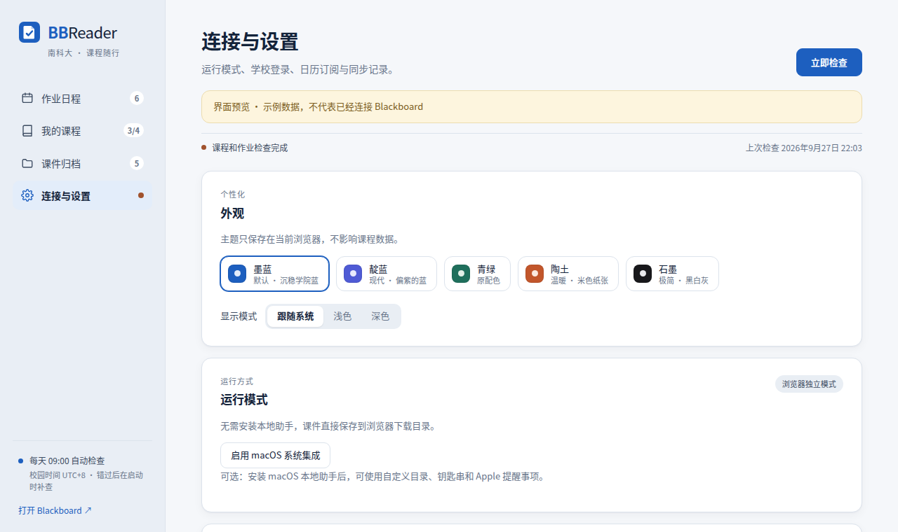

# BBReader

本仓库是 [Carbene/BBReader](https://github.com/Carbene/BBReader) 的桌面增强版 Fork，保留原作者版权及 MIT 许可证。桌面增强版的源码与更新由 [siyou-622/BBReader](https://github.com/siyou-622/BBReader) 提供。

南方科技大学（SUSTech）Blackboard 的 Chrome 扩展：把各门课的作业截止日期整理成一张日程，按学期和课程自动归档课件，可选同步到 Apple 提醒事项。

本次改造增加 Windows/macOS/Linux **Electron 桌面版**与**课件勾选下载**，原扩展入口、自动归档和 Web 示例预览保留。桌面启动：`npm ci` 后 `npm run desktop`；桌面安装包构建：`npm run desktop:dist`。最终用户直接运行安装包，无需外部浏览器或 Node/Python。

详见 [桌面安装、选择下载、路径兼容与依赖说明](docs/desktop-and-downloads.md)、[修改前功能清单与影响范围](docs/change-plan.md)、[回归记录与待实机验证清单](docs/regression.md)。课件页默认保留检查后自动下载；关闭新增开关后可以只扫描，再按课程勾选下载。“下载该课程全部课件”忽略搜索，明确仅作用于该课程全部已识别课件。

> 非官方项目，与南方科技大学及 Blackboard 无关。课程、作业和课件只保存在你自己的电脑上，不经过任何第三方服务器，也不会提交作业。



## 功能

- **作业日程**：读取当前学期全部已注册课程（包括 Blackboard 首页隐藏的课程），作业按“已过截止 / 今天 / 明天 / 未来七天 / 更晚”分组，显示剩余时间，可按状态、课程、关键词和日期筛选，支持导出 `.ics`。
- **课件归档**：按“学期 / 课程 / 内容目录”自动下载课件，未变化的文件不重复下载。
- **课件变更提醒**：检查后显示新增/更新数量，点击直接查看对应课件；首次收录建立基线，无法核对版本时给出提示。
- **桌面课件预览**：内置预览、系统默认软件或指定阅读软件；外部方式需已有下载文件，可在连接与设置中选择。
- **桌面软件更新**：更新窗口查看版本说明、下载进度和重启安装入口；连接本 Fork 的 Releases，便携版提供新版下载页。见 [更新与发布说明](docs/desktop-updates.md)。
- **自动检查**：每天在设定时间检查一次（默认校园时间 09:00，可调整），错过时在下次启动 Chrome 时补查。
- **保存校园账号**：登录过期时自动完成学校统一认证；浏览器模式加密保存，macOS 可使用系统钥匙串。
- **macOS 系统集成（可选）**：自定义归档目录、SHA-256 校验与去重、Apple 提醒事项同步。
- **外观**：五种主题配色，跟随系统 / 浅色 / 深色，适配窄屏。

| 深色模式 | 课件归档 | 外观设置 |
| --- | --- | --- |
|  |  |  |

截图为扩展自带的界面预览，使用示例数据。

## 下载

在本仓库的 [Releases](https://github.com/siyou-622/BBReader/releases/latest) 页面下载最新版本：

- `BBReader-0.3.2-windows-x64-setup.exe`：Windows 64 位安装版，安装后直接启动；推荐使用，支持后续应用内更新。
- `BBReader-0.3.2-windows-x64-portable.exe`：Windows 64 位便携版，直接运行，更新时前往下载页替换 EXE。
- 旧 0.3.1 用户需退出旧程序并手动安装一次 0.3.2；学校登录、课程索引和课件目录保持兼容。Windows 包未配置代码签名；macOS/Linux 桌面包须在对应系统构建和验收，目前不提供未经验证的成品包。

- `BBReader-browser.zip`：通用版，适用于 Windows、Linux 和 macOS（浏览器独立模式，无需安装其他程序）。
- macOS 可选本地助手：保留原 `scripts/build.py` 的 Apple Silicon 构建方式；本次 Release 没有提供该助手 ZIP，生成步骤见下方开发说明。

支持桌面版 Chrome 116 及以上；其他浏览器尚未验收。

## 自动检查

每天在设定时间自动检查一次，默认 **校园时间 09:00（UTC+8）**，可在“连接与设置 → 自动检查”调整（按校园时间计）。电脑休眠或 Chrome 关闭时不执行；当天过了设定时间后启动时补查，每个校园日最多自动检查一次。登录失效会提示重新登录并保留上次数据。手动检查不受每日次数限制。

## Windows / 通用浏览器版

1. 解压 `BBReader-browser.zip`，把 `BBReader-browser` 文件夹放到固定位置。
2. 在 Chrome 打开 `chrome://extensions`，启用“开发者模式”，选择“加载已解压的扩展程序”，打开包里的 **extension** 文件夹。
3. 在同一个 Chrome 用户配置中登录 `https://bb.sustech.edu.cn`。
4. 点击 BBReader 图标，再点击“立即检查”。课程、作业和文件会自动读取；可在“我的课程”中取消不需要的课程。**首次手动检查成功后才会开启每日自动检查。**
5. 课件默认直接下载到 `浏览器下载目录 / BBReader / 学期 / 课程 / 内容目录 / 文件`。可在 Chrome 设置中更改默认下载目录。

无需 Python、Node、Swift 或额外安装程序；这些工具仅用于开发。首次安装默认使用浏览器独立模式，不读取系统钥匙串、不连接 Reminders、不申请本地助手通信权限。

浏览器模式复用已有学校登录状态；学校会话失效时页面顶部会显示登录提示，点击“前往学校登录”（或“连接与设置 → 前往学校登录”）完成登录，再检查。也可在“连接与设置 → 学校统一认证”保存校园账号，登录过期时自动完成统一认证（见下方“保存校园账号”）。

## macOS 系统集成（可选）

当前助手提供 **Apple Silicon Mac** 版本。首次安装也可以直接使用上面的浏览器版。

1. 解压 `BBReader-macOS-arm64.zip`，将整个 `BBReader` 文件夹放到固定位置。
2. 双击“安装本地助手.command”。只安装到当前用户目录，无需管理员密码。
3. 在 Chrome 加载该包的 `extension` 文件夹；已有同 ID 扩展的用户更新原加载目录后重新载入即可，不要同时加载两个副本。
4. 在“连接与设置”启用“macOS 系统集成”，允许连接本地助手。
5. 课件默认归档到安装包内的 `BBReader/course-files`（安装时自动创建；已选择过根目录的保留原设置）。可点击“选择文件夹…”更改，在“我的课程”中可为各课程指定独立目录。首次归档可能需要允许助手访问下载文件夹。
6. 按需保存校园认证账号，或连接 Apple Reminders。

从 0.2.5 升级且已有归档、认证或提醒事项配置的 Mac，沿用系统集成。切换为浏览器模式会暂停使用系统功能，但保留原目录、钥匙串凭据及提醒事项；重新启用即可继续。两种模式分别保存下载记录，不会移动或删除另一种模式的文件。切换后下一次检查按所选模式保存。

助手为本地构建，尚无 Apple 开发者公证。从旧版本升级到 0.3.1 时请重新运行“安装本地助手.command”，以启用默认归档目录、暂存清理和提醒事项整理；已有归档目录、钥匙串凭据和提醒事项都会保留。更新助手后 macOS 可能要求重新确认提醒事项权限。

## 课程与作业日程

- 从完整注册列表读取当前学期课程，包括 Blackboard 首页隐藏的课程。学期采用学校起止日期，重叠时选最近开始的学期；按课程编号或课程名中的明确学期标识匹配。不把无学期的常设站点自动加入。
- 作业按截止时间排序，并分组为已过截止、今天、明天、未来七天、更晚和未设置时间；显示课程名、提交状态、剩余/逾期时长、逾期和未来七天统计。可按状态、课程、关键词筛选，月历可按日期筛选。日期使用校园时区，没有明确时间时不编造截止时间。
- 浏览器模式可勾选“已完成”，仅保存当前浏览器中的个人待办状态；不会提交 Blackboard 作业。手动勾选或重新打开会保留。未手动设置时，已提交或已评阅的作业视为完成。
- “连接与设置 → 外观”可选择主题配色（墨蓝、靛蓝、青绿、陶土、石墨）和显示模式（跟随系统 / 浅色 / 深色），仅保存在当前浏览器。
- 读取失败或任务暂时消失会保留旧记录；标为“此次未确认”的内容请以 Blackboard 为准。
- 支持导出带课程名的 `.ics` 快照；“课件归档”页可导出课程页面中的文字与链接（`.txt`）。Blackboard 原生日历订阅是另一条可选来源，其内容由学校生成，插件不会向它写入数据。

## 课件保存规则

文件及目录清理路径禁用字符，去掉开头的 `--` 等装饰符。**同一 Blackboard 内容条目有多个不同附件时创建条目名称子目录；单附件直接保存在当前目录；无附件不创建空目录。** 重复链接只计数一次。

**浏览器模式：** 直接通过 Chrome 下载，无本地助手。使用 ETag / Last-Modified 核对变化，结合浏览器下载记录避免重复下载；没有可靠版本信息时会重新下载。Windows 上会缩短过长的相对路径并保留扩展名，避免常见路径长度限制。文件同名时由浏览器保留新副本，不覆盖旧文件。路径规则改变后新下载使用新路径，不移动旧文件。清除下载历史、手动移动文件或更改默认下载目录可能导致重新下载；Chrome 对文件存在性的检查可能短暂滞后。此模式不读取本地文件内容，不提供本地 SHA-256 校验或内容去重。

**macOS 集成模式：** Chrome 只能先把文件下载到下载目录下的 `BBReader-staging` 暂存，助手验证格式及 SHA-256 后移入归档目录，并删除已清空的暂存目录；识别为登录页或空文件的暂存下载直接丢弃。默认按“根目录 / 学期 / 课程”保存；课程独立目录省略学期及课程层级。相同内容去重，同名不同内容用校验和后缀保留版本。路径变化时，只有与已记录校验值一致的归档才会迁移；手动修改的文件留在原位置，仅清理迁移后已空的目录。

两种模式都会报告浏览器拦截、失败下载和识别出的 HTML 登录响应，不会自动越过浏览器安全提示。若启用“下载前询问每个文件的保存位置”，可能需要逐次确认。下载队列的继续和恢复不会再次扫描课程。

## 保存校园账号

两种模式都只向学校 CAS 的 Blackboard 登录表单提交账号，且都不会导出或上传。

- **浏览器模式（Windows 等）：** 作为缺少系统钥匙串的补偿，SID 和密码以 AES-GCM 加密后保存在当前 Chrome 配置中，密钥为浏览器生成的不可导出密钥。不以明文保存，但安全性低于系统钥匙串：能访问该 Chrome 配置文件的人仍可能恢复密码。Mac 上若处于浏览器模式，页面会提示改用 macOS 系统集成。
- **macOS 系统集成：** 存放在本机登录钥匙串的 BBReader 专属条目。

“移除账号”删除当前模式保存的凭据；“清空索引与切换账户”同时删除浏览器中保存的凭据。每日自动检查最多尝试一次密码登录，失败后暂停密码重试；验证码仍需在学校页面完成。可通过“检查连接”手动重试，或重新保存修正后的凭据。

## macOS：认证与提醒事项

钥匙串条目只向学校 CAS 的 Blackboard 登录表单提交。没有设置每次 Touch ID 要求；后台读取被拒绝或钥匙串锁定时停止并提示。

“连接 Apple Reminders”首次申请系统权限，在默认账户中创建 **BBReader · 作业** 列表；之后按列表 ID 同步，用户改名仍可继续使用。每条提醒只包含“课程 · 作业”标题、截止时间和作业链接，不附加内部标识或说明文字。

- 每次检查完成后自动同步，包括设定时间的每日自动检查；也可点击“立即同步”同步已有读取结果。
- 相同账户、课程、作业更新原任务；保留自定义备注、提醒设置和手动完成状态。
- 保持列表整洁：同一作业的重复提醒只保留一条；在“我的课程”取消勾选的课程，其提醒会从列表移除；旧版本写入的 `BBReader-ID` 等说明会被清除，带账户标识后缀的旧列表名恢复为 **BBReader · 作业**。
- 新识别到 Blackboard 已提交/已评阅时标为完成；不会反向提交作业。手动重新打开的既有已提交任务保持打开。
- 浏览器模式的本地勾选独立保存，不写入 Reminders。系统集成模式显示 Reminders 完成状态。
- 暂停或切换模式不删除任务；读取失败或暂时未确认的作业也不会被删除。删除专属列表后需重新连接。
- Reminders 中设置“显示 → 排序方式 → 截止日期”，即可按截止时间排列。
- Apple Calendar 勾选“已安排的提醒事项 / Scheduled Reminders”即可显示同一批任务。跨设备同步由系统账户配置决定。

## 范围与数据

支持已探索的 Blackboard Original 课程内容、附件与普通 Assignment；第三方 LTI、视频、PDF 中的自然语言截止时间和特殊提交类型不保证识别。不会上传或提交作业。

课程、作业、个人完成标记和下载索引保存在当前 Chrome 配置的本地存储，不经过额外服务器；没有第三方分析服务。扩展不导出 Cookie、不读取浏览器凭据数据库；浏览器模式下自行保存的校园账号仅以加密形式存放。基础权限为 Blackboard 网站访问、存储、定时器、下载、DOM 解析及本站脚本读取；本地助手通信和学校 CAS 访问按需授权。

本地助手仅接受固定扩展 ID。新下载源文件限制为专属暂存目录；归档及迁移限制在用户配置目录，拒绝越界和符号链接，不接受 shell 命令。

## 开发与验证

```sh
npm test
python3 scripts/build.py --browser-only
# Apple Silicon Mac 上构建通用包和系统集成包：
python3 scripts/build.py
```

测试使用 Node 内置测试工具；打包使用 Python 标准库，不需要 npm 依赖。macOS 助手编译另外需要 Xcode Command Line Tools。通用打包在 Windows/Linux 上不调用 Swift 或 macOS 工具。输出：`dist/BBReader-browser.zip` 和可选的 `dist/BBReader-macOS-arm64.zip`。

DOM 测试：从项目根目录运行本地 HTTP 服务，打开 `tests/parser.html`；应显示 PASS。非扩展环境的 `extension/index.html` 显示标注为示例的界面预览，不连接学校。

### 验证状态

- 0.3.0 及以前的功能已在 Apple Silicon macOS 的 Google Chrome 上完成实机验收：读取当前学期课程与作业、截止时间与提交状态、课件下载与归档、SHA-256 去重、统一认证自动登录、Apple Reminders 同步及 Apple Calendar 显示。
- 0.3.1 新增的界面与主题、可调检查时间、浏览器加密保存账号由自动测试和 Chromium 实际加载验证；本地助手的默认归档目录、暂存清理与提醒事项整理由 Swift 自测覆盖（构建时运行），尚未完成完整实机回归。
- Windows 与 Linux 的浏览器独立模式由模拟 Chrome API 的自动测试覆盖，**尚未在 Windows 实机验收**。
- 未长期观察电脑休眠后的补查与外部日历订阅的刷新；Google Calendar、Outlook 等外部日历未实际配置。
- 只读取作业信息，从未执行上传或提交。

## 参与贡献

欢迎提交 Issue 与 Pull Request。提交前请运行 `npm test`；涉及 macOS 助手的改动请在 Mac 上运行 `python3 scripts/build.py`（包含 Swift 自测）。请勿在 Issue、测试或截图中附上校园账号、密码、Cookie、日历订阅链接或真实课程数据。

## 协议

[MIT](LICENSE) © 2026 Carbene。本项目为非官方工具，与南方科技大学及 Blackboard 无关；使用时请遵守学校相关规定。

## 更新记录

### 0.3.1

- 全新界面：分组作业日程、月历筛选、课程颜色、搜索、首次使用引导与登录过期提示；深色模式与窄屏适配；五种主题配色。
- 自动检查时间可调整（校园时间，默认 09:00），检查完成后同步提醒事项。
- 浏览器模式可加密保存校园账号，登录过期时自动登录；macOS 系统集成继续使用钥匙串。
- macOS：默认归档到安装包内的 `course-files`；自动清理下载目录中的暂存文件夹。
- Apple 提醒事项：不再附带内部标识和说明文字，自动去除重复提醒，取消勾选的课程会移除对应提醒。
- 新增扩展图标；更新扩展后不再重复打开欢迎页；构建脚本每次重新生成安装包。

### 0.3.0

- 浏览器独立模式：无需本地助手即可在 Windows、Linux 与 macOS 使用；macOS 系统集成改为可选。

## 卸载

在 Chrome 扩展管理页移除 BBReader；已下载课件保留，浏览器中保存的加密账号随扩展一并删除。若使用 macOS 集成，卸载前可在设置中移除保存的认证账号；再删除用户 Library/Application Support 下 BBReader 自有应用及 Chrome NativeMessagingHosts 中的 `cn.sustech.bbreader.json`、`cn.sustech.bbreader.picker.json`。提醒事项列表和日历订阅由用户自行管理，不随卸载删除。
